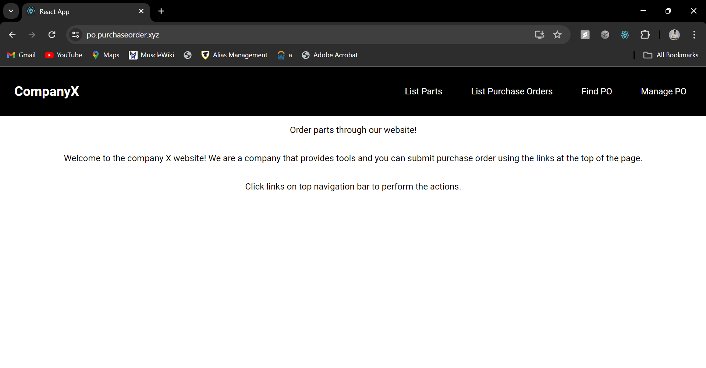
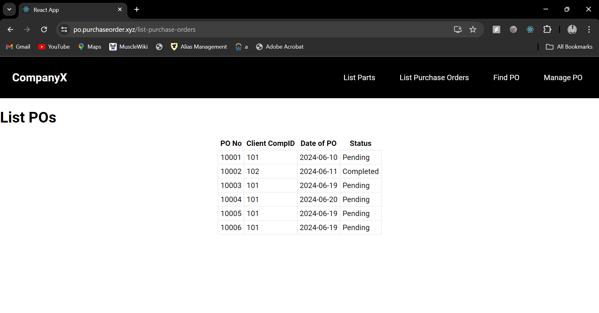
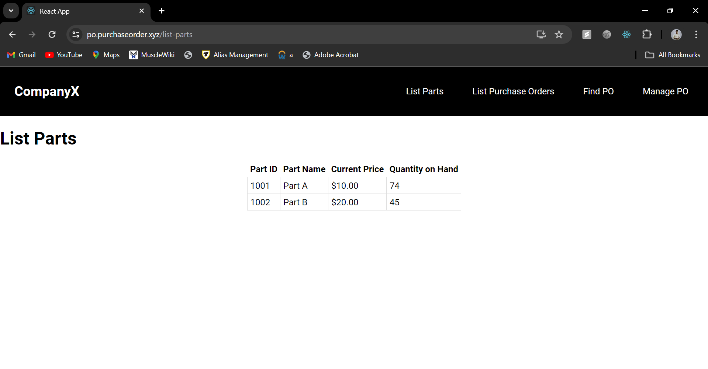

# Purchase Order Management System

## Introduction
This project is developed for the CSCI 4140 Advanced Database Systems course. It is a Purchase Order Management System that includes functionalities for preparing purchase orders (POs), adding lines to POs, and submitting POs. The system also allows listing parts and purchase orders. The project consists of a frontend built with React, a backend API built with Express.js, and a MySQL database.

## Deployment
The application is deployed on an AWS EC2 instance and is accessible via a domain managed by AWS Route 53. This setup allows for scalable and reliable hosting of the application.


## Prerequisites
- Node.js (v20.14.0 or higher)
- MySQL Server (v8.0 or higher)
- Git

## Installation
Follow these steps to set up the project:

1. **Clone the Repository:**
   ```sh
   git clone https://github.com/Jdurairaj-hub/Purchase-Order.git
   cd assn_2

2. **Install Backend Dependencies:**
    ```sh
    cd server
    npm install

3. **Install Frontend Dependencies:**
    ```sh
    cd ../client
    npm install

## Running the Application
1. **Start the Backend Server:**
    ```sh
    cd server
    node index.js

2. **Start the Frontend Development Server:**
    ```sh
    cd client
    npm start

3. **Access the Application:**
    Open your browser and navigate to `http://localhost:3001` for back-end
    Open your browser and navigate to `http://localhost:3000` for front-end

## Systemd Service File

To ensure the backend server starts automatically with the system and restarts on failure, the following `systemd` service file is used:

```ini
[Unit]
Description=Node.js App
After=network.target

[Service]
User=ubuntu
WorkingDirectory=/home/ubuntu/Purchase-Order/server
ExecStart=/usr/bin/npm start
Restart=always
StandardOutput=journal
StandardError=journal
SyslogIdentifier=my_purchase_order

[Install]
WantedBy=multi-user.target
```

This service file ensures that the Node.js backend server runs as a background service on the EC2 instance, with automatic restarts in case of failure. 

## Images

### Home Page


### Find Purchase Order


### List Purchase Order


### List Parts


